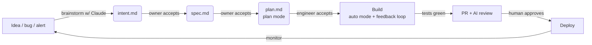

# Software Factory — Design

A repeatable, agent-driven production line for a 1–2 person company.
Goal: deliver software **systematically, methodically, and predictably** by turning
one-off decisions into committed artifacts and automated checks, so quality does not
depend on who is at the keyboard on a given day.

Principles (from the AI-native SDLC playbook, scaled down for a tiny team):
1. **Nothing is built without a written, reviewed plan.** Each stage ends by committing
   an artifact the next stage reads: `intent.md` → `spec.md` → `plan.md` → diff + tests → PR.
2. **The repo is the single source of truth.** No dual systems, no change board. The git
   history *is* the audit trail: who asked for what, what the agent produced, who approved.
3. **Standards live in files, not heads.** Conventions in `CLAUDE.md`, must-hold rules as
   skills backed by hooks.
4. **Every change verifies itself before a human looks.** One-command test/build/lint that
   the agent runs and pastes.
5. **Humans stay at the gates.** You review artifacts (plan, PR), not keystrokes.

---

## 1. The factory floor (repo layout)

One repo (or monorepo). This config is shared automatically across every parallel worktree
because it is committed to git.

```
/
├── CLAUDE.md                 # one page: commands, conventions, "things Claude gets wrong"
├── REVIEW.md                 # AI PR-review policy (Important vs nit, what to skip)
├── .claude/
│   ├── settings.json         # hooks: guardrails (build) + approval gates (deploy)
│   ├── skills/<name>/SKILL.md # encoded standards (security, API, brand/UX)
│   ├── agents/               # subagents: verifier, simplifier, researcher
│   └── commands/             # slash commands: /spec, /plan, /ship
├── intent/                   # intent.md proto-specs (Stage 1)
├── specs/                    # spec.md (Stage 2)
├── plans/                    # plan.md (Stage 3)
├── evals/                    # 20–50 real tasks + check scripts (Stage 4)
├── .github/workflows/        # CI: evals, PR review, deploy
├── ADOPTION-TRACKER.md       # rollout of the factory itself
├── DELIVERY-TRACKER.md       # the recurring production line (features in flight)
├── src/                      # product code
└── tests/                    # tests (must run with one command)
```

---

## 2. The production line (what every unit of work flows through)

This is the recurring "line." Each feature/fix moves left to right. Each stage has one
**gate** (a human decision) and produces one **committed artifact**. Track each unit in
`DELIVERY-TRACKER.md`.



| Stage  | You do                                   | Agent does                                  | Gate (artifact committed)        |
|--------|------------------------------------------|---------------------------------------------|----------------------------------|
| Plan   | Describe problem in your words           | Interviews you, drafts `intent.md`          | You accept → `intent.md`         |
| Design | Name constraints, resolve flags          | Produces `spec.md` under your skills        | You accept → `spec.md`           |
| Build  | Interrogate the plan, then let it run    | Plan mode → `plan.md`, then implements      | You accept plan → `plan.md`      |
| Test   | Set a quantifiable "done"                | Runs test/build/lint, fixes own mistakes    | Green checks pasted in PR        |
| Deploy | Judge intent + risk, approve             | Opens PR, addresses `@claude` review notes  | You approve → merge → deploy     |
| Maintain | Triage findings (later phase)          | (Phase 4) monitors, writes new `intent.md`  | New `intent.md` re-enters line   |

---

## 3. Parallel streams (your throughput multiplier)

You run 2–3 Claude Code sessions at once, each in its own **git worktree** on its own branch.
All sessions read the same committed `CLAUDE.md`, skills, and hooks, so they enforce identical
standards without you repeating yourself.

**Rules that keep parallelism safe:**
- **Split along file boundaries.** Use the `plan.md` files to pick tasks that touch *different*
  files. Tasks that share files run in one session, one after another — never in parallel.
- **Review is the throttle, not the model.** The ceiling is how many streams *you* can review
  well. Start at 2. Add a third only while reviews keep up.
- **Steer, don't type.** Your job is picking work, interrogating plans, reviewing PRs.
- **Subagents for recurring checks.** A `verifier` subagent runs the app in a fresh context and
  confirms behavior before a session reports done, so its verdict isn't colored by the code it wrote.

```
worktree: feat-billing   → Claude session 1  (plan.md → build → PR)
worktree: fix-rate-limit → Claude session 2  (plan.md → build → PR)
worktree: chore-evals    → Claude session 3  (only if review is keeping up)
        └── shared: CLAUDE.md, .claude/skills, .claude/settings.json (from git)
```

Commands: `git worktree add ../feat-billing feat-billing` then `claude` inside it.

---

## 4. Cost efficiency

You said stack is flexible and grounded in cost. Two levers: the **stack** and **agent usage**.

**Stack — pick "boring and well-documented."** The agent's error rate (and therefore your
rework cost, the biggest hidden cost) is lowest on mainstream tech it has deep training on.
A cheap, sane default for most product types:
- **Language/runtime:** TypeScript (Node) or Python — huge training coverage, low agent error rate.
- **Framework:** a mainstream, batteries-included one for your product type (avoid niche/new frameworks — they cost more in agent confusion than they save).
- **Data:** managed Postgres on a free/low tier (e.g. Neon/Supabase-class) — no ops overhead.
- **Hosting:** a serverless/edge platform with a real free tier; pay only as you scale.
- **CI:** GitHub Actions free minutes cover a 1–2 person team comfortably.

Re-decide per product only if the type demands it (e.g. mobile). Don't hand-tune the stack
for theoretical performance before you have users — that's premature cost.

**Agent usage — match model to task.**
- **Plan mode is the cheapest quality lever.** A tight `plan.md` means implementation is
  usually one pass; you pay once instead of re-prompting through a messy build.
- **Right-size the model:** cheap/fast model for boilerplate, refactors, and eval runs; the
  strongest model for architecture and gnarly debugging. Don't run the top model on lint fixes.
- **Subagents preserve context** (a researcher reports back a summary instead of flooding the
  main window), which keeps sessions shorter and cheaper.
- **Cap eval spend:** run the full eval suite on config changes + a nightly cron, not on every commit.
- **A good `CLAUDE.md` pays for itself:** every repeated mistake it prevents is a retry you don't buy.

---

## 5. Who does what (2 people, or 1)

The playbook assumes many roles; you collapse them. Suggested split for two people:

- **Product owner hat:** owns `intent.md` and `spec.md` acceptance, decides what ships.
- **Engineer hat:** owns `plan.md`, drives the parallel streams, owns PR merge.
- If solo, you wear both — the artifact chain still forces the separation of *decisions*
  (accept intent, accept plan, approve PR) so you don't skip your own gates.

Keep the gates even when it's just you. The discipline is what makes delivery predictable.
